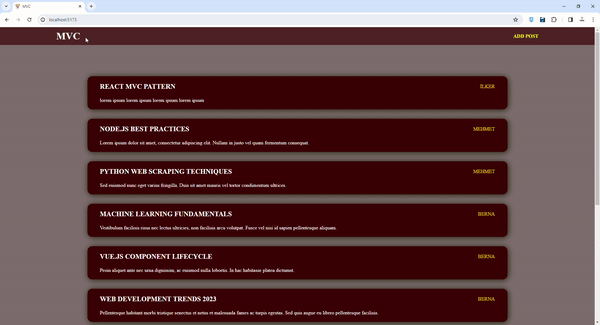

# MVC Project - Post Application

## Screen

## Overview
This project is a simple post application built using the Model-View-Controller (MVC) architecture. The application allows users to view a list of posts, add new posts, and view posts by a specific user.

## Technologies Used
- React: A JavaScript library for building user interfaces.
- React Router: A library for navigation in a React application.
- Axios: A promise-based HTTP client for making requests to a server.
- JSON Server: A fake REST API server for testing and prototyping.

## Project Structure

### Components
- **Header:** The navigation header with links to view all posts and add a new post.
- **ListPostView:** Displays a list of posts. Clicking on a post user's name opens a popup displaying all posts by that user.
- **AddPostView:** Provides a form for adding a new post.
- **PopUpView:** Displays a popup showing all posts by a specific user.

### Controllers
- **ListPostController:** Manages the data fetching for the list of posts.
- **AddPostController:** Handles the logic for adding a new post.
- **PopUpController:** Controls the data passed to the PopUpView.

### Models
- **AddPostModal:** Defines the structure of a new post.

## Running the Project

### Prerequisites
- Node.js installed on your machine.
- npm or yarn package manager.

### Setup
1. Clone the repository to your local machine.
2. Navigate to the project directory in the terminal.
3. Run `npm install` or `yarn install` to install the project dependencies.

### Running the Server
1. Run `npm run server` to start the JSON Server, which simulates a REST API for posts.

### Running the React App
1. In a new terminal window, run `npm run dev` to start the React development server.

### Accessing the App
1. Open your browser and go to `http://localhost:3000` to access the application.

## Usage
- Click on "Posts" in the header to view all posts.
- Click on "Add Post" to add a new post.
- Click on a user's name in the post list to view all posts by that user in a popup.
- Close the popup by clicking the "Close" button.

## Note
This project is a demonstration of a basic React application using the MVC architecture. It utilizes React Router for navigation, Axios for API requests, and JSON Server as a mock API. Feel free to explore and modify the code to suit your needs.
